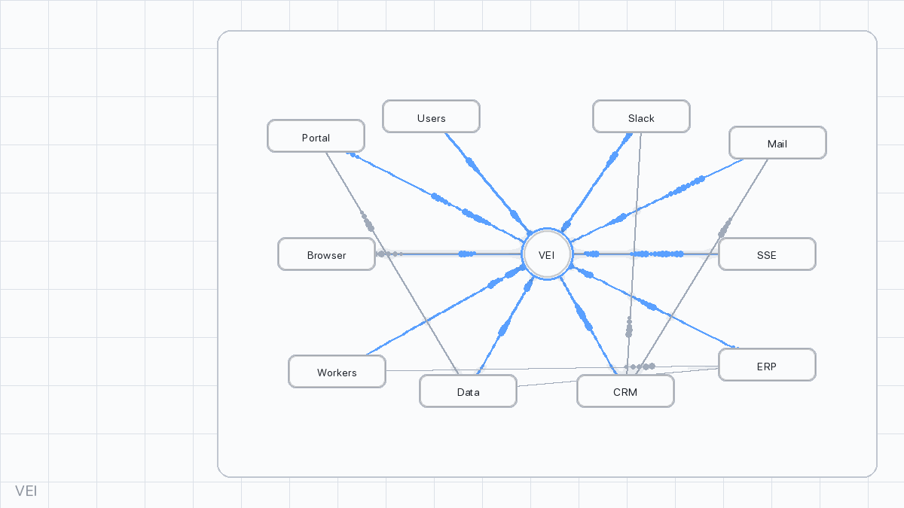

## VEI (Virtual Enterprise Internet)



Fully synthetic, MCP-native Slack/Mail/Browser world. A single MCP server exposes tools and a seeded event bus so agents can practice multi-app workflows deterministically and reproducibly.

<!-- Demo branch change for GitHub workflow demonstration -->

### Highlights
- **MCP-native tools**: `slack.*`, `mail.*`, `browser.*`, and `vei.*` helpers.
- **Deterministic**: seeded event bus for replies/arrivals/interrupts; identical runs for a fixed seed + artifacts.
- **No external SaaS**: all data is synthetic; live modes can be sandboxed.

### Architecture
```
Agent ──MCP──► VEI Router (this repo)
                      │
                      ├─ slack.{live|replay|sim}
                      ├─ email.{live_local|replay|sim}
                      └─ browser.{replay|live}
                               ▲
                        Seeded Event Bus (async)
                               ▲
                     Replay Stores (.mcpz + .wacz/.har)
```

### Modes (per connector)
- **Live**: dev/sandbox endpoints with guardrails.
- **Replay**: deterministic playback from `.mcpz` and `.wacz`.
- **Sim**: seeded emulators that speak the same MCP schemas.

## Quickstart

### Prerequisites
- Python 3.11+
- OpenAI API key (only for LLM demos/tests). Smoke tests and stdio transport do not require a key.

### Install
```bash
pip install -e ".[llm,sse]"
```
Optional: add `[browser]` only for live browser automation (Playwright).

### Configure
Create a `.env` at the repo root:
```env
# Required
OPENAI_API_KEY=sk-your-actual-api-key-here

# Optional
# OPENAI_BASE_URL=https://api.openai.com/v1

# VEI configuration
VEI_SSE_URL=http://127.0.0.1:3001/sse
VEI_SEED=42042
VEI_ARTIFACTS_DIR=./_vei_out
```

### Verify setup
```bash
python test_vei_setup.py
```
You should see “All critical checks passed!”. The SSE server may show as “Not running”; it auto-starts when you run a demo.

### Transport smoke tests (stdio first; SSE optional)
Quick end-to-end checks without an API key:
```bash
# StdIO MCP transport (spawns python -m vei.router)
vei-smoke --transport stdio --timeout-s 30

# SSE MCP transport (auto-starts python -m vei.router.sse if needed)
vei-smoke --transport sse --timeout-s 30

# Or via a Python script that runs both and falls back to a direct Router test
python tests/test_vei_transports.py
```

### Run the demo
Use the VEI CLI tools
```bash
# Interactive chat (stdio default; SSE optional)
vei-chat --model gpt-5 --max-steps 15 --transport stdio --timeout-s 45
# Or explicitly use SSE (requires local SSE or remote server)
vei-chat --model gpt-5 --max-steps 15 --transport sse --timeout-s 45

# Automated test
vei-llm-test --model gpt-5 \
  --task "Research product price, get Slack approval < $3200, email vendor for a quote."

# One-command demo with artifacts
vei-demo --mode llm --model gpt-5 --artifacts-dir ./_vei_out/demo_run
vei-demo --mode llm --transport stdio --model gpt-5 --artifacts-dir ./_vei_out/demo_run
```

 

### Train a simple policy
Run a minimal random-policy loop with the Gym-like environment:

```bash
python examples/rl_train.py --episodes 5 --max-steps 20 --out-dir ./_vei_out/rl_run
```

The evaluation episode writes a trace to the directory above. Score the run:

```bash
python - <<'PY'
from vei.score_core import compute_score
print(compute_score('_vei_out/rl_run'))
PY
```

### Testing
Prefer invoking pytest via the active interpreter to avoid host shims:
```bash
python -m pytest -q
```
Live LLM test (uses stdio; requires `.env` with `OPENAI_API_KEY`):
```bash
python -m pytest -q -k llm_stdio_smoke
```
Artifacts: the LLM test writes a `trace.jsonl` to `VEI_ARTIFACTS_DIR` if set, or to a temp directory otherwise. A copy is saved under `.artifacts/llm_stdio_smoke_trace.jsonl`, and the last lines are echoed to the console for quick inspection.

Notes:
- The LLM test uses MCP stdio (no SSE required) and is included in the full suite; it runs automatically when `OPENAI_API_KEY` is available (`python -m pytest -q`).
- Customize via env: `VEI_MODEL` (e.g., `gpt-5`), `LLM_SMOKE_PROMPT` to override the system prompt.
- If your `.env` contains a placeholder or invalid `OPENAI_API_KEY`, the LLM test may attempt to run and fail; unset it to skip or set a valid key.

### Start the MCP server (manual, optional)
```bash
VEI_SEED=42042 python -m vei.router.sse
```
SSE endpoints (FastMCP defaults; only needed if using `--transport sse` or an HTTP client):
- Stream: `http://127.0.0.1:3001/sse`
- Messages: `http://127.0.0.1:3001/messages/`

Troubleshooting:
- Ensure `uvicorn` is installed (covered by the `[sse]` extra).
- Set `VEI_HOST`/`VEI_PORT` if 3001 is busy.
- Increase server logs with `FASTMCP_LOG_LEVEL=DEBUG`.
- If autostart fails silently, check `_vei_out/sse_autostart.log` for errors.
- If your shell mangles `$` in tasks, quote or escape it (e.g., `"<$3200"` or `\$3200`).

### Start the MCP server via CLI (with ERP aliases)
```bash
vei-serve --alias-packs xero,netsuite --erp-error-rate 0.0 \
  --seed 42042 --artifacts-dir ./_vei_out --host 127.0.0.1 --port 3001
```

### ERP twin, alias packs, and scoring

VEI includes a deterministic ERP twin with purchase orders, receipts, invoices, three‑way match, and payments.

- Tools: `erp.create_po|get_po|list_pos|receive_goods|submit_invoice|get_invoice|list_invoices|match_three_way|post_payment`.
- Alias packs: vendor‑style tool names that map to the ERP twin.
  - Configure CSV via `VEI_ALIAS_PACKS`, e.g. `xero,netsuite,dynamics,quickbooks`.
  - Examples: `xero.create_purchase_order` → `erp.create_po`, `netsuite.invoice.create` → `erp.submit_invoice`.
- Error injection (no latency): set `VEI_ERP_ERROR_RATE=0.05` to occasionally return validation/payment errors deterministically.

Score a Procure‑to‑Pay run:
```bash
vei-score-erp --artifacts-dir ./_vei_out/run_2025_08_17
```


### CRM twin, alias packs, and scoring

VEI includes a deterministic CRM twin for lead→opportunity workflows.

- Tools: `crm.create_contact|get_contact|list_contacts|create_company|get_company|list_companies|associate_contact_company|create_deal|get_deal|list_deals|update_deal_stage|log_activity`.
- Alias packs: vendor‑style tool names mapped to the CRM twin.
  - Configure CSV via `VEI_CRM_ALIAS_PACKS` (e.g., `hubspot,salesforce`).
  - Examples: `hubspot.contacts.create` → `crm.create_contact`, `salesforce.opportunity.update_stage` → `crm.update_deal_stage`.
- Error injection (no latency): set `VEI_CRM_ERROR_RATE=0.05` to occasionally return consent violations deterministically when contacting DNC leads.

Serve with flags:
```bash
vei-serve --crm-alias-packs hubspot,salesforce --crm-error-rate 0.0   --alias-packs xero --erp-error-rate 0.0 --seed 42042 --artifacts-dir ./_vei_out
```

Score a CRM run:
```bash
vei-score-crm --artifacts-dir ./_vei_out/run_2025_08_17
```

### LLM-friendly loop
- Call `vei.observe` to get `{time_ms, focus, summary, action_menu, pending_events}`.
- Choose one tool from `action_menu` (or any allowed tool) and call it.
- Repeat; optionally `vei.reset` to restart the episode.

Examples (MCP):
- `vei.act_and_observe {"tool":"browser.read","args":{}}`
- `vei.tick {"dt_ms":15000}`
- `slack.send_message {"channel":"#procurement","text":"Posting summary for approval"}`
- `mail.compose {"to":"sales@macrocompute.example","subj":"Quote request","body_text":"Please send latest price and ETA."}`

 

### LLM models & API
- GPT‑5 calls use the OpenAI Responses API (`client.responses.create`), not legacy Chat Completions.
- No temperature or unsupported params are sent to GPT‑5/5‑mini.
- Default prod model: `gpt-5`. Tests/smoke default: `gpt-5-mini` (override via `VEI_MODEL`).

## LLM Evaluation & Scoring (gpt‑5)

- **Objective**: Research product details (citations), post approval to `#procurement` (<$3200), email the vendor for a quote, and parse the vendor reply (price + ETA).
- **Transport**: MCP stdio (`python -m vei.router`) for determinism and CI friendliness.
- **Artifacts**: Set `VEI_ARTIFACTS_DIR` to a clean directory. The router writes `trace.jsonl` there; CLIs may also write a human‑readable transcript.
- **Scoring**: `vei-score` evaluates `trace.jsonl` for subgoals: `citations`, `approval`, `email_sent`, `email_parsed`. Success requires all in `full` mode.

Run a “real” gpt‑5 test and score it
```bash
export VEI_ARTIFACTS_DIR=_vei_out/gpt5_llmtest
VEI_SEED=42042 vei-llm-test \
  --model gpt-5 \
  --max-steps 32 \
  --task "Open product page, read specs, post approval to #procurement (budget $3200; include citations), email sales@macrocompute.example for quote, then wait for the reply."

vei-score --artifacts-dir _vei_out/gpt5_llmtest --success-mode full
```

Notes on model behavior and failure modes
- **Empty/observe plans**: If the model outputs `{}` or explicitly chooses `vei.observe`, no tool call is executed and no `trace.jsonl` entry is produced. This is not a transport failure, but the episode will not reach success and scoring will return `success: false`.
- **Time advancement**: Vendor replies are scheduled ~15s after `mail.compose`. Each `call_and_step` advances time by 1000 ms, so expect ~15 additional steps (or call `vei.tick`) before the reply arrives.
- **Demo loop vs llm-test**:
  - `vei-demo --mode llm` auto‑advances time after `mail.compose`/`slack.send_message`, which can reduce required steps.
  - `vei-llm-test` takes the model’s plan literally; ensure `--max-steps` is high enough for email and reply.
- **Determinism**: Runs are deterministic under a fixed `VEI_SEED`. Reuse the same seed and artifacts dir to reproduce behavior.

Troubleshooting
- If scoring shows zero actions, inspect the transcript to confirm whether the model only issued `vei.observe` (a no‑op). Re‑run or increase `--max-steps`.
- If using a custom gateway, add `--openai-base-url default` to force the OpenAI Responses endpoint.

## Expose MCP Environment

- Stdio (recommended): Local, deterministic, no network server needed.
  - Server: `python -m vei.router`
  - Used by `vei-llm-test`, `vei-demo`, and `vei-chat` by default.
  - Discovery: `mcp.list_tools` includes `vei.*`, and `vei.help` returns the tool catalog + examples.
- SSE (optional, HTTP/SSE): Useful for remote access or non‑Python clients.
  - Server: `VEI_HOST=0.0.0.0 VEI_PORT=3001 VEI_SEED=42042 python -m vei.router.sse`
  - Client: pass `--transport sse` to the CLIs or use an MCP SSE client and the `VEI_SSE_URL`.

## Use Other LLMs

There are two simple paths:

1) OpenAI‑compatible gateway (Responses API)

- Requirements: your gateway must expose OpenAI’s Responses API at `/v1/responses`.
- Configure:
  - `OPENAI_BASE_URL=https://your-gateway/v1`
  - `OPENAI_API_KEY=...`
- Run with any model id your gateway supports:
```bash
VEI_ARTIFACTS_DIR=_vei_out/llmtest \
vei-llm-test --model your-model --max-steps 32 --transport stdio
```
- Notes: the planner first requests `response_format={type: json_schema}`; if unsupported, it retries without it and still expects a JSON object `{"tool":..., "args":{}}`.

2) Bring‑your‑own planner (Anthropic or any SDK)

- Keep VEI as a pure MCP server and drive it with your own loop:
  1. Start stdio server: `python -m vei.router` (or use SSE).
  2. Connect via MCP client and call `session.initialize()`.
  3. Loop:
     - Call `vei.observe {}` to get `{time_ms, focus, action_menu, pending_events}`.
     - Ask your LLM to return a strict JSON plan: `{"tool":"...","args":{...}}`.
     - If `tool == "vei.observe"`, call it directly; otherwise call `vei.act_and_observe {tool,args}` to execute and get a post‑action observation in one step.
     - After `mail.compose` or `slack.send_message`, call `vei.tick {dt_ms:20000}` and then `vei.observe {}` to deliver vendor replies.
     - Repeat for N steps; write a transcript and set `VEI_ARTIFACTS_DIR` to capture `trace.jsonl`.
- Discover tools: call `mcp.list_tools` and `vei.help` (lists `vei.*`, `slack.*`, `mail.*`, `browser.*` and examples).
- Score the run: `vei-score --artifacts-dir _vei_out/<run_dir> --success-mode full`.

Tip: To hard‑swap the built‑in CLIs to your SDK, replace the OpenAI client calls in `vei/cli/vei_llm_test.py` (and `vei/cli/vei_demo.py`) with your provider’s SDK while preserving the `{tool,args}` output shape.
- MCP transport for dev/CI is stdio-only (no SSE required).

Sample vei-llm-test transcript (gpt-5-mini, 6 steps)
```json
[
  {
    "observation": {
      "time_ms": 1000,
      "focus": "browser",
      "summary": "Browser: MacroCompute — Home — Welcome to MacroCompute. Find laptops and specs.",
      "screenshot_ref": null,
      "action_menu": [
        {"tool": "browser.click", "args": {"node_id": "CLICK:open_pdp#0"}, "name": "Open product page"},
        {"tool": "browser.read", "args_schema": {}},
        {"tool": "browser.find", "args_schema": {"query": "str", "top_k": "int?"}}
      ],
      "pending_events": {"slack": 0, "mail": 0}
    }
  },
  {
    "action": {
      "tool": "browser.find",
      "args": {"query": "laptop", "top_k": 5},
      "result": {
        "hits": [{"node_id": "CLICK:open_pdp#0", "role": "button", "name": "Open product page"}]
      }
    }
  }
]
```


### Examples

```bash
python examples/local_router_min.py     # in-process Router loop
python examples/mcp_client_stdio_min.py # minimal MCP client over stdio
python examples/llm_stdio_min.py        # minimal live LLM loop over stdio (no SSE)
```

## Configuration
- **MCP server**: `VEI_HOST`, `VEI_PORT` (defaults `127.0.0.1`, `3001`).
- **SSE URL**: `VEI_SSE_URL` (default `http://127.0.0.1:3001/sse`).
- **Artifacts**: `VEI_ARTIFACTS_DIR=/abs/out` writes `trace.jsonl`.
- **Transcript**: `VEI_TRANSCRIPT_OUT=/abs/transcript.json` to save transcript JSON (used by `examples/llm_stdio_min.py`).
- **Streaming**: `VEI_TRACE_POST_URL=https://collector.example/trace` streams entries (best-effort POST).
- **Scenarios**: set `VEI_SCENARIO` to a catalog name, `VEI_SCENARIO_CONFIG` to JSON or a file path for a template, or `VEI_SCENARIO_RANDOM=1` to pick a random catalog entry.
- **OpenAI-compatible routing**: `OPENAI_API_KEY`, optional `OPENAI_BASE_URL`.
- **CLI overrides**: `--openai-base-url`, `--openai-api-key`.
- **Autostart**: set `VEI_DISABLE_AUTOSTART=1` to prevent background SSE startup.

### Transports: stdio vs SSE
- **Stdio (recommended for local/CI)**: No open ports, same tools/capabilities. Use `--transport stdio` with CLI or run `examples/llm_stdio_min.py`.
- **SSE (optional)**: Needed only for HTTP-based clients or remote hosting. Default endpoints `/sse` and `/messages/`.

### MCP Compatibility
- Implements Anthropic MCP via FastMCP.
- Supports stdio (default) and SSE transports.
- Tool schemas defined via Pydantic; clients receive structured args/returns.

## MCP tools
- `slack.*`: `list_channels`, `open_channel`, `send_message`, `react`, `fetch_thread`.
- `mail.*`: `list`, `open`, `compose`, `reply`.
- `browser.*`: `open`, `find`, `click`, `type`, `submit`, `read`, `back`.
- `erp.*`: `create_po`, `get_po`, `list_pos`, `receive_goods`, `submit_invoice`, `get_invoice`, `list_invoices`, `match_three_way`, `post_payment`.
- `vei.*` helpers: `observe`, `act_and_observe`, `tick`, `pending`, `reset`.

Alias examples (when enabled via `VEI_ALIAS_PACKS`):
- `xero.create_purchase_order {vendor, currency, lines:[{item_id, desc, qty, unit_price}]}`
- `netsuite.invoice.create {vendor, po_id, lines:[{item_id, qty, unit_price}]}`
- Or generically: `vei.call {"tool":"xero.list_purchase_orders","args":{}}`

## Deterministic replay
- Fixed seed + fixed artifacts + fixed build ⇒ identical tool payloads, event timings, DOM hashes, and screenshots.
- Two layers:
  - Tools replay via `.mcpz` bundles (tool calls, responses, timings).
  - Browser replay via `.wacz` web archives and a DOM-graph (state = node, edge = affordance alias).

## Logging and evaluation

### Artifacts directory
After each run, check the artifacts directory:
```
_vei_out/run_TIMESTAMP/
├── transcript.json     # Full conversation log
├── transcript.jsonl    # Line-by-line events
└── trace.jsonl         # Detailed execution trace
```

### Scoring
```bash
vei-score --artifacts-dir ./_vei_out/run_20240115_143022
```
Evaluates task completion, subgoals, costs (action count), provenance, and constraint compliance.

## Scenarios
- Built-in names (set `VEI_SCENARIO`):
  - `macrocompute_default` — minimal world (home → pdp → specs).
  - `extended_store` — adds a category page with two products.
- Provide your own via `VEI_SCENARIO_CONFIG` (JSON string or file path).

### Advanced usage
- Custom scenarios via env/file:
```bash
export VEI_SCENARIO_CONFIG='{"budget_cap_usd": 5000, "vendors": [...]}'
export VEI_SCENARIO_CONFIG=/path/to/template.json
export VEI_SCENARIO_RANDOM=1  # choose random catalog scenario
```
- Deterministic runs:
```bash
export VEI_SEED=12345
vei-demo --mode llm --artifacts-dir ./run1
export VEI_SEED=12345
vei-demo --mode llm --artifacts-dir ./run2
# diff run1/transcript.json run2/transcript.json
```
- Stream traces:
```bash
export VEI_TRACE_POST_URL=https://your-collector.com/endpoint
```

### Best practices
- Start simple → then scale to complex workflows
- Always set `VEI_ARTIFACTS_DIR`/`--artifacts-dir` for debugging
- Use `vei-score` to validate completion
- Fix the seed for reproducibility
- Monitor `transcript.jsonl` for real-time events

## Test plan (must pass)
- Replay determinism across runs (same seed).
- Event determinism for Slack/Mail.
- Invalid action handling is deterministic.
- Scoring robust to common email quoting/casing variations.

## Safety & compliance
- No external PII; all fixtures synthetic.
- Live browser respects domain whitelist and blocks POST.
- Slack live is for dev workspaces only; rate-limited.

## MCP config snippet
`mcp.json` is included:
```json
{
  "mcpServers": {
    "vei": {
      "transport": {
        "type": "stdio",
        "command": "python3",
        "args": ["-m", "vei.router"],
        "env": { "VEI_SEED": "42042" }
      }
    }
  }
}
```

To expose the server over SSE instead, start `python3 -m vei.router.sse`
and point an `sse` transport at `http://127.0.0.1:3001/sse`.

### Common SSE Issues
- Client hangs connecting → server not running. Start it manually or use tools that auto-start (e.g. `vei-chat`, `vei-smoke --transport sse`).
- Connection refused → wrong host/port. Check `VEI_SSE_URL`, `VEI_HOST`, `VEI_PORT`.
- ImportError on start → missing deps. Install with `pip install -e .[sse]`.
- Need verbose logs → export `FASTMCP_LOG_LEVEL=DEBUG`.
- Corporate proxies affecting localhost posts → set `NO_PROXY=127.0.0.1,localhost` and unset `HTTP(S)_PROXY`.
- Mixed origins (localhost vs 127.0.0.1) → keep exactly the same host in both GET /sse and POST /messages.
- If still stuck, use stdio transport for development: `vei-chat --transport stdio` or `vei-smoke --transport stdio`.

### MCP library versions
- Ensure a modern `mcp` is installed for both client and server code paths:
  - `pip install -U "mcp>=1.13.0"`
  - Verify with: `python -c "import mcp; print(getattr(mcp,'__version__','unknown'))"`

## Status
Minimal runnable slice with deterministic Slack/Mail events and a simple virtual site. Extend scenarios under `vei/world/`.
